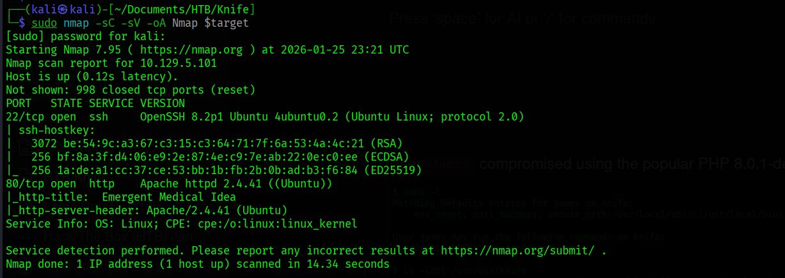

# [Target: Knife] Operational Engagement Report

> **Syntropy Intel:** 🧠 [Mental Model: The Poisoned Well](../../../00-Mental-Models/The-Poisoned-Well.md) | 🛡️ [Detection Rules: PHP 8.1.0 Backdoor](../../../02-Detection-Engineering/PHP-Backdoor-UserAgentt.md)

## 1. Executive Summary
**Objective:** Assessment of the host "Knife" to identify exploitable paths to high-privilege access.
**Outcome:** **Critical Compromise** (Root Authority Achieved).
**Key Findings:**
* **Supply Chain Compromise:** The host was running a backdoored version of PHP (8.1.0-dev) containing a malicious commit.
* **Privilege Escalation:** Misconfigured `sudo` permissions allowed the `knife` administrative tool to execute arbitrary code as root.
* **Business Impact:** Immediate, unauthenticated remote code execution leading to total infrastructure takeover.

## 2. Reconnaissance: Identifying the Supply Chain Break
**The Filter:**
We initiated a targeted scan to identify the attack surface. Standard web ports were open, but the version header revealed a critical anomaly.

* **Port 22:** OpenSSH 8.2p1.
* **Port 80:** Apache 2.4.41 (Ubuntu) running **PHP 8.1.0-dev**.

**Operator's Assessment:**
The version `PHP 8.1.0-dev` is historically significant. In March 2021, the PHP Git repository was compromised, and a backdoor was injected into the source code. This is not a "bug" but an intentional **Supply Chain Attack**.


*Figure 1: Service enumeration reveals the compromised PHP version.*

Further analysis with `whatweb` confirmed the `X-Powered-By` header, validating the target was running the poisoned build.


*Figure 2: Header analysis confirms the specific development build.*

## 3. The Strategic Pivot: The "User-Agentt" Backdoor
**The Vector:** Unauthenticated Remote Code Execution (RCE).
**The Mechanism:**
The backdoor logic in PHP 8.1.0-dev looks for a specific HTTP header: `User-Agentt` (note the double 't'). If the string starts with `zerodium`, the code following it is passed directly to `zend_eval_string()`.

**Execution:**
We utilized a Python script to inject the payload into the malicious header.
* **Header:** `User-Agentt: zerodiumsystem("whoami");`
* **Result:** Immediate execution as `james`.


*Figure 3: Triggering the backdoor to achieve initial foothold.*

## 4. Privilege Escalation: The "Janus" Tool
**Initial Access:** User `james` context established.
**Enumeration:**
A review of sudo privileges (`sudo -l`) revealed a critical misconfiguration. The user `james` was permitted to run `/usr/bin/knife` as `root` without a password.


*Figure 4: Identification of the 'knife' binary in sudoers.*

**The Escalation:**
`knife` is a command-line tool for the Chef infrastructure automation platform. It includes an `exec` command designed to run Ruby scripts.
* **The Flaw:** By allowing `knife` to run as root, the administrator implicitly allowed **any Ruby code** to run as root.
* **The Exploit:** We invoked `knife exec` to spawn a system shell.

```bash
sudo /usr/bin/knife exec -E 'exec "/bin/sh"'
```
*Figure 5: abusing the intended functionality of 'knife' to pivot to Root.*

## 5. Syntropy Retrospective
**Why This Happened:**
1.  **Supply Chain Failure:** The organization deployed a "dev" version of a core language (PHP) into production without verifying the integrity of the binary. This bypassed standard vulnerability scanning because the flaw was not a CVE in the code logic, but a malicious injection in the source itself.
2.  **Trust Boundary Failure:** The `knife` tool was treated as a "simple binary" rather than a "script interpreter." Allowing an interpreter (like python, ruby, knife, or java) to run as root is functionally equivalent to granting a root shell.

**Remediation Roadmap:**
1.  **Immediate:** Downgrade PHP to a stable, verified release (e.g., 8.0.x or patched 8.1.x) obtained from the official package repository, not a development branch.
2.  **Tactical:** Remove the sudo entry for `/usr/bin/knife`. If administrative access is required for Chef management, restrict execution to specific, read-only scripts or require a strong password.
3.  **Strategic:** Implement "Software Bill of Materials" (SBOM) scanning to prevent development builds ("-dev", "-nightly") from reaching production interfaces.


*Figure 6: Full Attack Path Visualization.*
