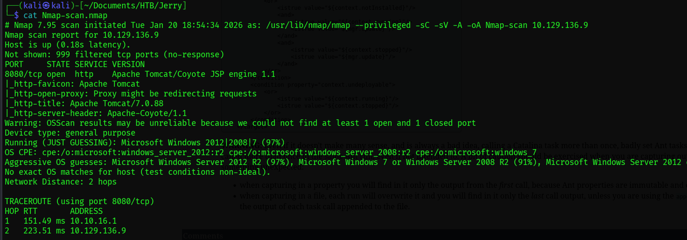
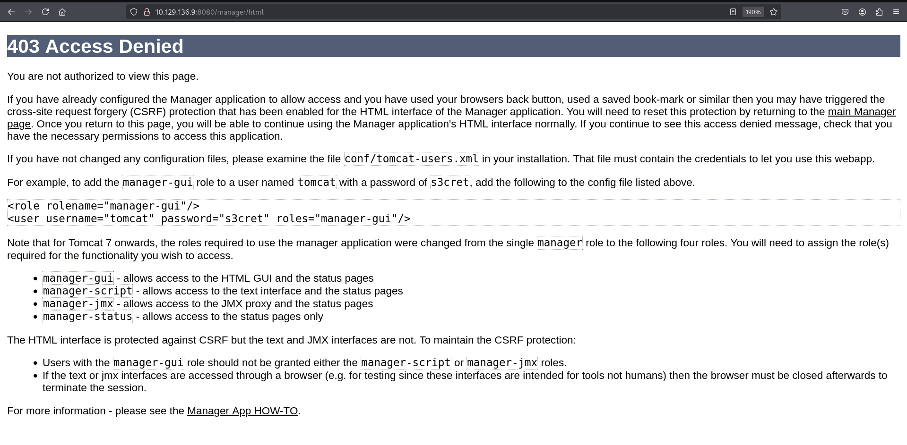

# [Target: Jerry] Operational Engagement Report

> **Syntropy Intel:** 🧠 [Mental Model: The Exposed Console](../../../00-Mental-Models/The-Exposed-Console.md) | 🛡️ [Detection Rules: Tomcat WAR Deployment](../../../02-Detection-Engineering/Tomcat-WAR-Deploy.md)

## 1. Executive Summary
**Objective:** Assessment of the host "Jerry" to identify exploitable paths to high-privilege access.
**Outcome:** **Critical Compromise** (NT AUTHORITY\SYSTEM Authority Achieved).
**Key Findings:**
* **Critical Vulnerability:** Apache Tomcat Manager Application exposed with Default Credentials.
* **Architectural Failure:** Failure to segregate management interfaces from the public network; usage of vendor-default credentials.
* **Business Impact:** Immediate Remote Code Execution (RCE) leading to total infrastructure takeover.

## 2. Reconnaissance: The Glass House
**The Filter:**
We initiated a targeted scan to identify the attack surface. The host exposed minimal ports, indicating a specialized application server.

* **Port 8080:** Apache Tomcat/Coyote JSP Engine 1.1.

**Operator's Assessment:**
The presence of Port 8080 typically indicates a Java-based web application container. We performed directory enumeration to identify hidden administrative endpoints.

*Figure 1: Initial port enumeration reveals a Tomcat instance on 8080.*

*Figure 2: Directory enumeration confirms the presence of `/manager` and `/docs`.*

## 3. The Strategic Pivot: Credential Hygiene Failure
Upon accessing the web root, we attempted to access the `/manager/html` dashboard. The server responded with a **403 Access Denied** error. Crucially, the error message leaked the credential configuration structure—a "Verbose Failure" vulnerability that hinted at the expected role and user format.

*Figure 3: The server denies access but hints at the authentication mechanism.*

**The Breakthrough:**
We attempted standard default credential pairs for Apache Tomcat using Basic Authentication.
* **Credentials:** `tomcat` / `s3cret`

*Figure 4: Authentication challenge on the Manager interface.*

This resulted in immediate access to the **Tomcat Web Application Manager**. This dashboard allows an administrator to deploy `.war` (Web Archive) files—a feature designed for developers but weaponizable by attackers.

*Figure 5: Successful authentication reveals the administrative console.*

## 4. Exploitation: Weaponized Deployment
**The Vector:** Authenticated Remote Code Execution (RCE) via WAR Deployment.
**The Mechanism:**
Tomcat allows the upload of `.war` files which are automatically unpacked and executed by the servlet container.

**Method A: Manual GUI Upload**
We verified the manual upload capability via the GUI, confirming that no WAF (Web Application Firewall) or file-type validation was in place to block malicious JSP code.

*Figure 6: Uploading the malicious 'Application' via the GUI.*

**Method B: Command Line Deployment (Syntropy Standard)**
To maintain operational stealth and speed, we constructed a malicious JSP payload using `msfvenom` and deployed it via `curl`.
1.  **Payload Generation:** Created `shell.war` containing a JSP reverse shell.
2.  **Deployment:** Uploaded the archive via the `/manager/text/deploy` endpoint.
3.  **Trigger:** Accessed the deployed endpoint (`/shell`) to force execution.

*Figure 7: Generating the payload (Left) and catching the SYSTEM shell (Right).*

## 5. Post-Exploitation & Impact
**Initial Access:**
The reverse connection was established immediately. Due to the Tomcat service running with high privileges (a critical configuration error), the session was established as **NT AUTHORITY\SYSTEM**.

*Figure 8: Confirmation of high-privilege access and data exfiltration.*

**Proof of Compromise:**
We successfully retrieved both the User and Root flags, confirming total control over the asset.

*Figure 9: Engagement objectives met.*

## 6. Syntropy Retrospective
**Why This Happened:**
The compromise was not due to a software bug, but a **procedural failure**. The "Manager" app is a powerful administrative tool that was:
1.  Exposed to the network (Lack of Segmentation).
2.  Protected by documented default credentials (Lack of Hardening).

**Remediation Roadmap:**
1.  **Immediate:** Change the `tomcat` user password in `tomcat-users.xml`.
2.  **Tactical:** Restrict access to the `/manager` endpoint to localhost (127.0.0.1) or a specific Management VLAN IP range.
3.  **Strategic:** Implement a "Least Privilege" service account for the Tomcat service so that RCE does not result in SYSTEM-level access.
