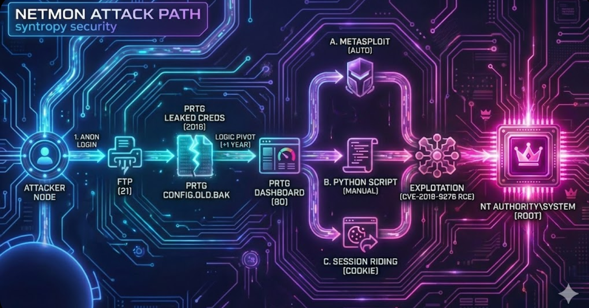
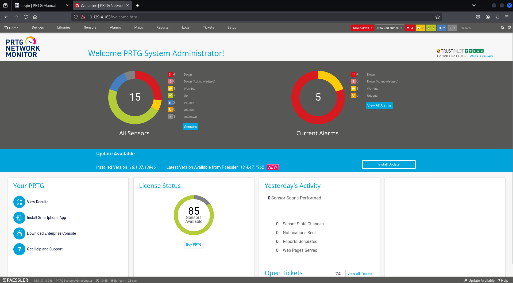
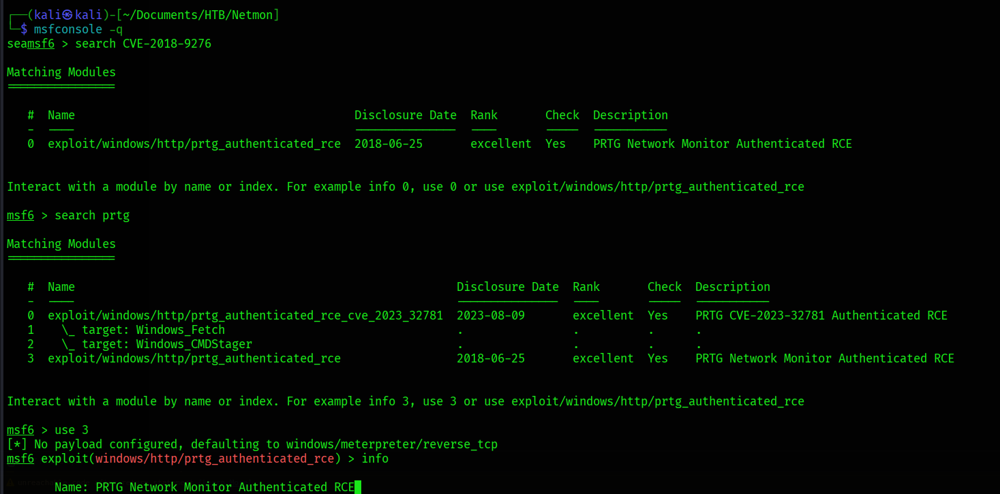
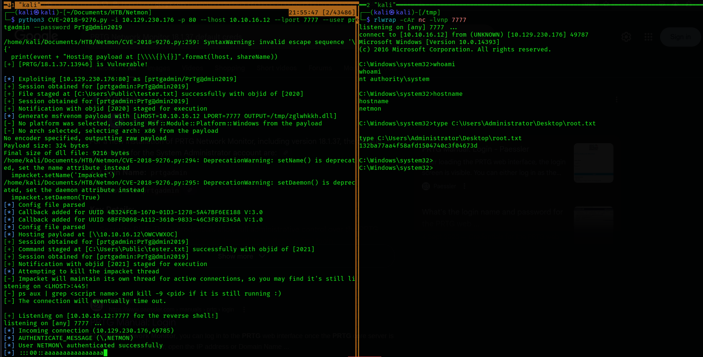

| Syntropy Intel: 🧠 [Mental Model: The Artifact Echo](../../../00-Mental-Models/The-Artifact-Echo.md) | 🛡️ [Detection Rules: PRTG RCE](../../../02-Detection-Engineering/Detection-PRTG-RCE.md) |

# Hack The Box (HTB) Netmon Machine Writeup | [54nK4lP3x3]

**Hack the Box machine walkthrough of [HTB Netmon](https://app.hackthebox.com/machines/Netmon) by: [54nK4lP3x3](https://github.com/Sanka1pp)**

## 1. Executive Summary

**Objective:** Assessment of the host "Netmon" to identify exploitable paths to high-privilege access.
**Outcome:** **Critical Compromise** (System Authority Achieved).

**The Kill Chain:**
1.  **Recon:** Identification of Anonymous FTP (Port 21) and PRTG Network Monitor (Port 80).
2.  **Information Leakage:** Discovery of sensitive backup files (`PRTG Configuration.old.bak`) containing administrative credentials.
3.  **Logic Pivot:** Deducting the current password (`2019`) based on the pattern found in the leaked credential (`2018`).
4.  **Exploitation:** Leveraging CVE-2018-9276 (Authenticated RCE) via three distinct vectors to achieve `NT AUTHORITY\SYSTEM`.

**Attack Path Visual:**

*Figure 1: The complete attack chain from anonymous access to System compromise.*

---

## 2. Reconnaissance: The Open Door
**The Filter:**
Initial scanning identified a Windows host exposing web and file transfer services.
* **Port 21:** Microsoft FTP Service.
* **Port 80:** Indiy httpd (PRTG Bandwidth Monitor).

*Figure 2: Initial port scan revealing the attack surface.*

**The Anomaly:**
Anonymous authentication was enabled on the FTP service. This provided read-access to the system drive (`C:\`). While enumerating the directory structure, we identified the user flag on the Public Desktop (`C:\Users\Public\Desktop\user.txt`) and, more critically, the PRTG installation directory.

*Figure 3: Successful anonymous FTP login.*

---

## 3. The Artifact: Configuration Leakage
**The Discovery:**
Navigating to `%ProgramData%\Paessler\PRTG Network Monitor`, we identified a backup configuration file named `PRTG Configuration.old.bak`. The existence of a `.bak` file implies a snapshot taken prior to a configuration change.

*Figure 4: Identification of sensitive configuration backups.*

**Credential Extraction:**
Exfiltrating and analyzing the file revealed a cleartext password for the `prtgadmin` user: `PrTg@dmin2018`.

*Figure 5: Recovery of the 2018 administrative password.*

---

## 4. The Logic Pivot
**Authentication Failure:**
Initial login attempts with `PrTg@dmin2018` failed.

**Pattern Recognition:**
Analyzing the credential structure (`Prefix` + `@` + `Admin` + `Year`) against the current operational timeframe suggested a standard rotation policy.
* **Hypothesis:** The password for the current year is `PrTg@dmin2019`.
* **Result:** Validated. Successful authentication to the PRTG Web Console.

*Figure 6: Successful authentication using the predicted password.*

---

## 5. Exploitation: Multi-Vector RCE
**Vulnerability:** CVE-2018-9276 (Authenticated Command Injection in PRTG Notification Manager).
To confirm the severity and flexibility of the flaw, we executed the compromise using three distinct methods.

### Method A: Automated Framework (Metasploit)
We utilized the standard Metasploit module to automate the notification staging and payload delivery.
* **Module:** `exploit/windows/http/prtg_authenticated_rce`
* **Configuration:** `set ADMIN_PASSWORD PrTg@dmin2019`
* **Outcome:** Stable Meterpreter session as `NT AUTHORITY\SYSTEM`.

*Figure 7: Metasploit module configuration.*

### Method B: Manual Python Exploit
To avoid framework signatures, we utilized a standalone Python PoC (`CVE-2018-9276.py`). This script manually constructs the HTTP POST requests to create a malicious notification.
* **Command:** `python3 exploit.py -i 10.10.10.152 -u prtgadmin -p PrTg@dmin2019`
* **Outcome:** Reverse shell connection received on listener.

*Figure 8: Manual exploitation via Python script.*

### Method C: Session Riding (Cookie Bypass)
Simulating a scenario where the password is unknown but a session is active (e.g., XSS or physical access), we extracted the `Octopusa` session cookie and injected it into a bash exploit script (`rce.sh`).
* **Technique:** Bypass login prompt by supplying a valid Cookie header.
* **Command:** `./rce.sh -c "Octopusa=..."`
* **Outcome:** Successful command execution without re-entering credentials.

*Figure 9: Extracting the admin session cookie.*

*Figure 10: Final System shell achieved via Session Riding.*

---

## 6. Syntropy Retrospective
**Why This Happened:**
The compromise was not technical, but procedural. The administrator left a "digital footprint" (the backup file) in a public directory. This single error negated the security of the password rotation.

**Remediation:**
1.  **Immediate:** Disable Anonymous FTP.
2.  **Sanitization:** Scrub backup files from web/ftp roots.
3.  **Patching:** Update PRTG Network Monitor to the latest stable release to close CVE-2018-9276.
