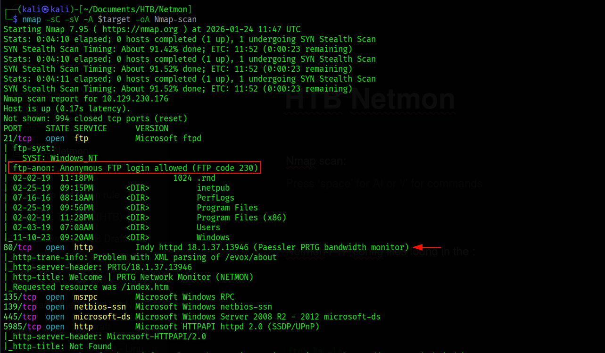
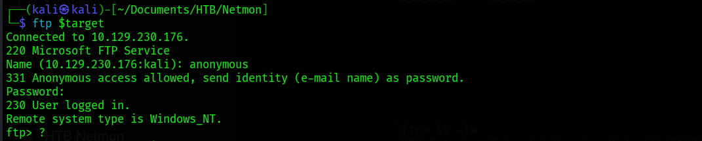
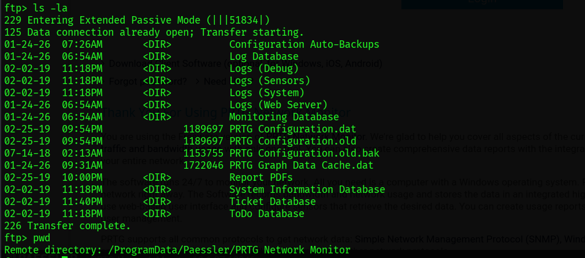
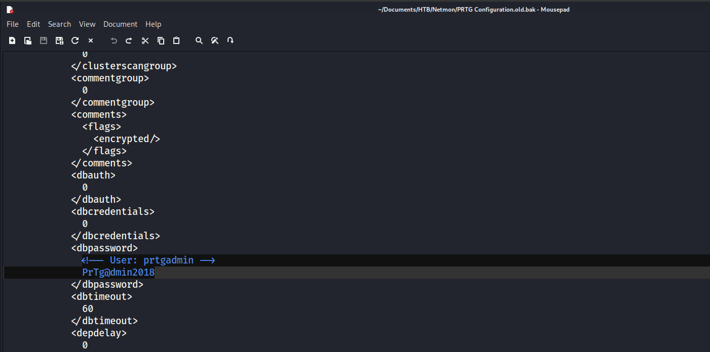
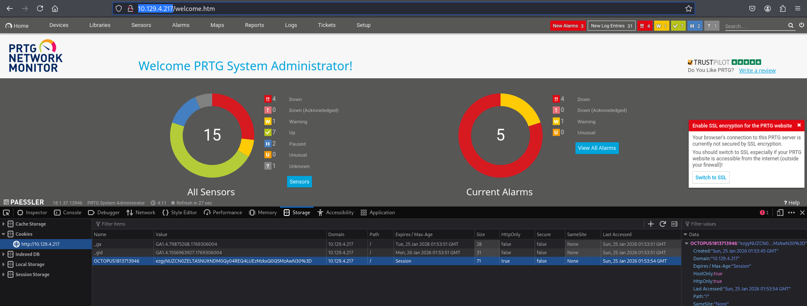
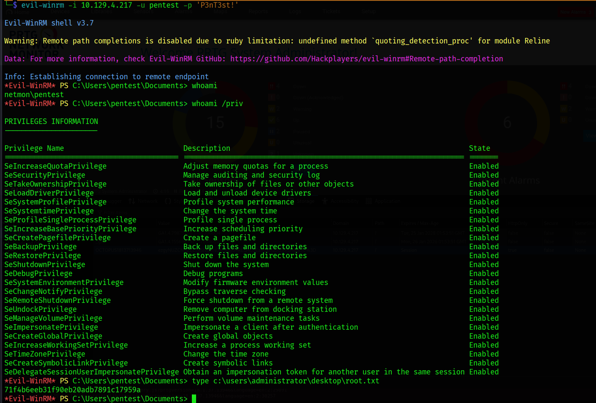

# 🎯 Target: Netmon (Windows)

**Difficulty:** Easy
**IP:** `10.10.10.152`
**Tags:** `FTP` `Config Leak` `PRTG` `CVE-2018-9276`
**Status:** 🚩 Compromised

---

## 1. Executive Summary
**Objective:** Assessment of the host "Netmon" to identify exploitable paths to high-privilege access.
**Outcome:** **Critical Compromise** (System Authority Achieved).
**Key Findings:**
* **Information Leakage:** Anonymous FTP access exposed sensitive configuration backups containing administrative credentials.
* **Weak Credential Policy:** The administrative password followed a predictable rotation pattern (Year-based), allowing for easy deduction of the current password.
* **Vulnerable Application:** The host was running an unpatched version of PRTG Network Monitor susceptible to Authenticated Remote Code Execution (RCE).

---

## 2. Reconnaissance: The Open Door
**The Filter:**
Initial scanning identified a Windows host exposing web and file transfer services.

* **Port 21:** Microsoft FTP Service.
* **Port 80:** Indiy httpd (PRTG Bandwidth Monitor).

*Figure 1: Initial port scan revealing the attack surface.*

**The Anomaly:**
Anonymous authentication was enabled on the FTP service. This provided read-access to the system drive (`C:\`). While enumerating the directory structure, we identified the user flag on the Public Desktop (`C:\Users\Public\Desktop\user.txt`) and, more critically, the PRTG installation directory.

*Figure 2: Successful anonymous FTP login.*

---

## 3. The Artifact: Configuration Leakage
**The Discovery:**
Navigating to `%ProgramData%\Paessler\PRTG Network Monitor`, we identified a backup configuration file named `PRTG Configuration.old.bak`. The existence of a `.bak` file implies a snapshot taken prior to a configuration change.

*Figure 3: Identification of sensitive configuration backups.*

**Credential Extraction:**
Exfiltrating and analyzing the file revealed a cleartext password for the `prtgadmin` user: `PrTg@dmin2018`.

*Figure 4: Recovery of the 2018 administrative password.*

---

## 4. Exploitation: The Logic Pivot & RCE
**The Pivot:**
Initial login attempts with the recovered password failed. Analyzing the credential pattern (`...2018`) against the current timeframe suggested a year-based rotation policy.
* **Hypothesis:** The password for the current year is `PrTg@dmin2019`.
* **Result:** Validated. Successful authentication to the PRTG Web Console.

**The Exploit (CVE-2018-9276):**
The installed version of PRTG contained a vulnerability in the Notification Manager. By injecting shell commands into the "Parameter" field of a notification script, we could achieve code execution.

We utilized a script technique involving **Session Riding**:
1.  Extracted the active administrator cookie from the browser session.
2.  Injected the cookie into the exploit payload to bypass the script's default login mechanism.

*Figure 5: Extracting the session cookie for exploit authorization.*

**Execution:**
The payload created a new system user and subsequently spawned a reverse shell running as `NT AUTHORITY\SYSTEM`.

*Figure 6: Final proof of high-privilege compromise.*

---

## 5. Syntropy Retrospective
**Why This Happened:**
The compromise was not technical, but procedural. The administrator left a "digital footprint" (the backup file) in a public directory. This single error negated the security of the password rotation.
**Lesson:** Backups must be treated with the same security classification as the live data they protect. A backup in a public folder is a public secret.
