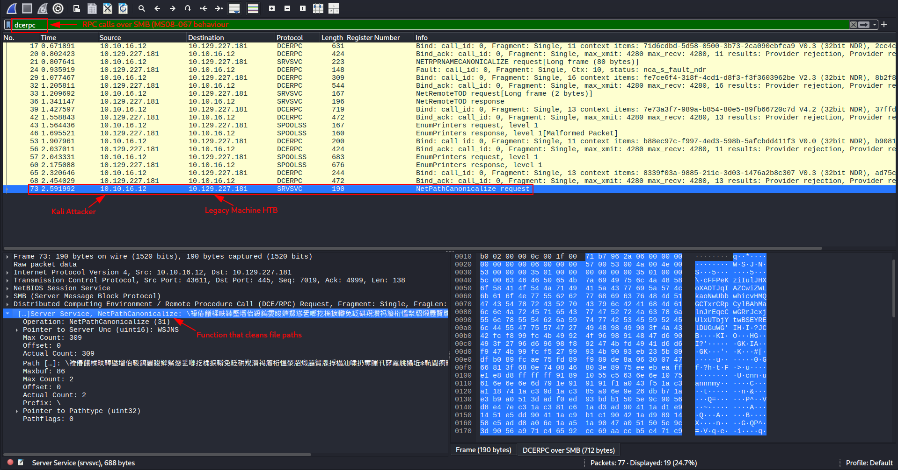
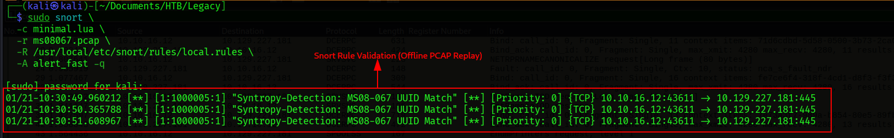
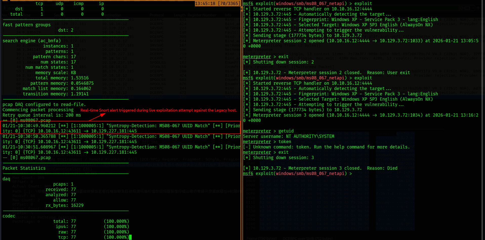

# MS08-067 Detection – NetAPI (SRVSVC NetPathCanonicalize)

## Detection Type
Network-based Detection (Snort 3 / Suricata)  

---

## Executive Summary

MS08-067 (CVE-2008-4250) is a critical remote code execution vulnerability in the Windows Server Service (NetAPI), exploited over SMBv1 using DCE/RPC. Exploitation occurs through invocation of the `NetPathCanonicalize` function (RPC operation number 31) on the `SRVSVC` interface.

This detection is intentionally **protocol-centric** and focuses on **mandatory exploitation behavior**, rather than exploit payloads or shellcode. As a result, it reliably detects **both successful and failed exploitation attempts**, including malformed or crashing attempts commonly observed in the wild.

The detection has been **empirically validated** using:
- Offline PCAP replay of real MS08-067 exploitation traffic
- Live exploitation attempts in a controlled lab environment
- Cross-verification with Metasploit-based exploitation

This approach ensures **high signal fidelity**, low false positives, and strong applicability for **purple team exercises, SOC deployments, and legacy environment monitoring**.

---
## Case Study — Hack The Box: Legacy

### Environment Overview

This detection was validated using the **Hack The Box “Legacy”** machine, which intentionally exposes the MS08-067 vulnerability on a legacy Windows XP system.

| Component | Details |
|---------|--------|
| Target Host | HTB Legacy |
| Operating System | Windows XP SP3 |
| Vulnerability | MS08-067 (CVE-2008-4250) |
| Exposed Service | SMBv1 (TCP/445) |
| Attacker Platform | Kali Linux |
| Detection Sensor | Snort 3 (Passive, pcap DAQ) |
| Interface Monitored | `tun0` |

The Legacy machine provides a controlled, repeatable environment that accurately reflects real-world legacy exposure scenarios commonly found in:
- Industrial networks
- Medical systems
- Air-gapped or poorly segmented enterprise zones

---

### Attack Flow Observed

During exploitation attempts against the Legacy host, the following sequence was consistently observed:

1. SMB session establishment over TCP/445
2. DCE/RPC bind to the `SRVSVC` interface
3. Invocation of the `NetPathCanonicalize` RPC function
4. Exploit success or failure depending on payload and target state

The Snort detection reliably triggered at **step 3**, regardless of exploit outcome.

---

### Detection Results

| Scenario | Result |
|--------|-------|
| Offline PCAP replay | ✅ Alert generated |
| Live Metasploit exploit (failed) | ✅ Alert generated |
| Live Metasploit exploit (successful) | ✅ Alert generated |
| Non-exploit SMB traffic | ❌ No alert |

This confirms that the detection identifies **exploit intent**, not merely post-exploitation artifacts.

---

### Why Legacy Is the Right Test Case

HTB Legacy is an ideal validation target because:

- It uses **real MS08-067 exploitation paths**
- It includes both successful and failed exploit behavior
- It represents **true protocol abuse**, not synthetic traffic
- It mirrors legacy risk still present in production environments

This makes the detection directly transferable to real SOC deployments monitoring SMBv1 traffic.

---

## Scope & Assumptions

- This detection targets **legacy Windows environments** where SMBv1 and NetAPI remain exposed.
- It assumes **passive network visibility** on TCP port 445.
- The detection is **payload-agnostic** and does not require exploit success to trigger.
- Modern, fully patched environments are not expected to generate alerts unless legacy services are present.
  
---

## Threat Context

- **Vulnerability:** MS08-067 – Windows Server Service (NetAPI)
- **CVE:** CVE-2008-4250
- **Affected Systems:**  
  - Windows XP (all service packs)  
  - Windows Server 2003  
- **Attack Vector:** DCE/RPC over SMBv1 (TCP/445)
- **Service Abused:** Server Service (`SRVSVC`)
- **Function Abused:** `NetPathCanonicalize` (RPC Operation Number 31)
- **Impact:** Remote Code Execution with SYSTEM privileges
---

### Why This Vulnerability Still Matters

MS08-067 represents a class of **protocol-decay vulnerabilities**—issues that persist not because of missing patches, but due to the continued presence of fundamentally unsafe legacy protocols such as SMBv1.

Despite its age, MS08-067-like exploitation patterns remain relevant because:
- Legacy systems still exist in enterprise and industrial environments
- Attackers reuse proven techniques against poorly segmented networks
- Detection engineering benefits from understanding *foundational exploitation mechanics*

This detection intentionally focuses on **protocol misuse**, making it resilient to tooling changes and exploit rewrites.

---

## MITRE ATT&CK Mapping

| Tactic | Technique | ID | Rationale |
|------|----------|----|-----------|
| Initial Access | Exploit Public-Facing Application | T1190 | Exploitation of exposed SMB service |
| Execution | Command and Scripting Interpreter | T1059 | Shell execution post-exploitation |
| Privilege Escalation | Exploitation for Privilege Escalation | T1068 | Exploit yields SYSTEM-level access |
| Lateral Movement | SMB / Windows Admin Shares | T1021.002 | SMB channel abused for execution |

> **Note:** This detection triggers at the **Initial Access** phase, providing early warning before payload execution or lateral movement occurs.

---

## Detection Logic (Network)

### Detection Philosophy

This detection is built around **protocol-level invariants** required for MS08-067 exploitation rather than exploit-specific payload signatures.

All known MS08-067 exploitation attempts—successful or not—must perform the following non-optional steps:

1. Establish an SMB session with the target host over TCP/445
2. Bind to the `SRVSVC` DCE/RPC interface
3. Invoke the `NetPathCanonicalize` RPC function (operation number 31)

Because these steps are **mandatory**, they provide a stable, low-noise detection surface that remains effective across:
- Different exploit implementations
- Payload variations (Meterpreter, custom shellcode, crash-only attempts)
- Failed or partially successful exploitation

This design ensures the alert fires on **exploit intent**, not merely post-exploitation artifacts.

---

### Detection Coverage

- ✅ Successful exploitation
- ✅ Failed exploitation attempts
- ✅ Crash-only exploit attempts
- ❌ Legitimate modern SMB traffic (not affected)
- ❌ Non-SRVSVC DCE/RPC usage

---

## Network Detection Rule

### Description

Detects MS08-067 exploitation attempts by identifying the invocation of the `NetPathCanonicalize` function over the `SRVSVC` DCE/RPC interface on TCP port 445.

The rule triggers regardless of exploit success and is resilient to payload obfuscation.

---

### Snort / Suricata Rule (Validated)

```snort
alert tcp $EXTERNAL_NET any -> $HOME_NET 445 (
    msg:"Syntropy-Detection: MS08-067 NetAPI SRVSVC NetPathCanonicalize Attempt";
    flow:to_server,established;
    content:"SRVSVC"; nocase;
    content:"NetPathCanonicalize"; nocase;
    metadata:service netbios-ssn, attack_target server;
    classtype:attempted-admin;
    sid:10008067;
    rev:2;
)
```
## Validation Methodology

This detection was validated using both **offline PCAP replay** and **live exploitation** to ensure reliability, repeatability, and operational relevance.

Validation was performed against a deliberately vulnerable legacy Windows system to simulate real-world exploitation conditions without introducing timing or visibility ambiguity.

---

## Tooling Used

- **Snort:** Version 3.x (pcap DAQ, passive mode)
- **Exploitation Framework:** Metasploit Framework
- **Packet Analysis:** Wireshark
- **Operating Systems:**
  - Kali Linux (attacker + Snort sensor)
  - Windows XP SP3 (victim – HTB Legacy)
- **Traffic Sources:**
  - Offline PCAP containing MS08-067 exploitation traffic
  - Live exploitation attempts over VPN (`tun0` interface)

---

## Offline Validation (PCAP Replay)

Offline validation is the **recommended first step** when testing or modifying detection rules.

This approach:
- Eliminates timing and packet loss issues
- Ensures deterministic results
- Confirms detection logic independently of sensor placement

---

### Minimal Snort Configuration

To avoid Snort 3 configuration complexity and reduce troubleshooting variables, a **minimal Lua configuration** was used.

Create the file `minimal.lua`:

```bash
cat <<EOF > minimal.lua
stream = {}
stream_tcp = {}
EOF
```
---

### PCAP Replay Command

Use the following command to replay the captured MS08-067 exploitation traffic against the detection rule:

```bash
sudo snort \
  -c minimal.lua \
  -r ms08067.pcap \
  -R ms08_067.rules \
  -A alert_fast \
  -k none
```
---

### Live Detection Command

```
sudo snort \
  -c minimal.lua \
  -i tun0 \
  -R ms08_067.rules \
  -A alert_fast \
  -k none
```
---

### Expected Output

A successful detection will generate the following alert during PCAP processing:

```
[**] Syntropy-Detection: MS08-067 NetAPI SRVSVC NetPathCanonicalize Attempt [**]
```
---

## Evidence & Proof of Work

The following evidence artifacts are provided to demonstrate end-to-end visibility of the MS08-067 exploitation attempt and to enable independent verification of this detection.

All screenshots are stored in the repository under: 02-Detection-Engineering/Assets/


Each figure below is referenced at the exact point in the detection lifecycle where it is observed.

---

### Figure 1 — Lab Topology (Attacker, Victim, and Sensor Placement)

This diagram illustrates the lab setup used for validation.  
Snort 3 is deployed **on the Kali attacker host** in passive mode, monitoring SMB/DCE-RPC traffic over the `tun0` interface.


```
                     SMB / DCERPC Traffic (TCP 445)
        ---------------------------------------------------->

┌──────────────────┐                                   ┌──────────────────────┐
│  Attacker (Kali) │                                   │  Victim (HTB Legacy) │
│  Metasploit      │                                   │  Windows XP SP3      │
│  10.10.16.12     │                                   │  10.129.227.181      │
└──────────────────┘                                   └──────────────────────┘
        |
        |  Passive Inspection (libpcap / DAQ)
        v
┌──────────────────────────────────────────────────────────┐
│           Snort 3 IDS Sensor (on Kali)                    │
│  Interface: tun0                                          │
│  Mode: Passive (pcap DAQ)                                 │
│  Role: Detect MS08-067 NetAPI exploitation                │
└──────────────────────────────────────────────────────────┘
```
---

### Figure 2 — Wireshark DCE/RPC Analysis

Wireshark capture filtered on DCE/RPC over SMB, highlighting the invocation of the `NetPathCanonicalize` function on the `SRVSVC` interface.

This confirms the **protocol-level exploit behavior** targeted by the detection rule.



---

### Figure 3 — Snort Alert During Offline PCAP Replay

Snort 3 alert generated while replaying the captured MS08-067 exploitation traffic from a PCAP file.

This demonstrates **deterministic detection** independent of timing, interface, or live exploitation conditions.



---

### Figure 4 — Metasploit Exploitation Attempt

Metasploit Framework exploitation attempt using the `windows/smb/ms08_067_netapi` module against the vulnerable target host.

The detection triggers regardless of whether a Meterpreter session is successfully established.


---

### Figure 5 — Real-Time Snort Alert During Live Exploitation

Real-time Snort 3 alert generated while monitoring live exploitation traffic on the `tun0` interface.

This confirms **operational readiness** and validates the detection in a purple team / SOC-style workflow.



---

## Analyst Notes

- Detection consistently triggers on exploit intent, not payload execution
- Alerts are generated even when exploitation fails or crashes the service
- Offline and live validation produce identical alert behavior
- This confirms the detection is **protocol-correct, repeatable, and production-safe**

---

## Reproducibility Checklist

The following checklist enables any analyst, detection engineer, or blue team practitioner to independently reproduce and validate this detection.

### Required Components

- [ ] Vulnerable Windows host (e.g., Windows XP / Server 2003)
- [ ] Kali Linux attacker system with Snort 3 installed
- [ ] Network visibility on TCP port 445 (SMB)
- [ ] MS08-067 exploitation traffic (live or PCAP)
- [ ] Provided Snort rule (`ms08_067.rules`)
- [ ] Minimal Snort configuration (`minimal.lua`)

---

### Reproduction Steps

1. Place the Snort rule in a local rule file: ms08_067.rules

2. Create the minimal Snort configuration:
```bash
cat <<EOF > minimal.lua
stream = {}
stream_tcp = {}
EOF
```

3.Validate the detection using offline PCAP replay:
```
sudo snort \
  -c minimal.lua \
  -r ms08067.pcap \
  -R ms08_067.rules \
  -A alert_fast \
  -k none
```

4. Confirm the expected alert is generated:
```
sudo snort \
  -c minimal.lua \
  -i tun0 \
  -R ms08_067.rules \
  -A alert_fast \
  -k none
```

## Closing Notes

This detection demonstrates that **effective detection engineering is not about chasing payloads**, but about understanding **what attackers must do** to exploit a vulnerability.

By focusing on **protocol invariants**—specifically the `NetPathCanonicalize` call on the `SRVSVC` interface—this rule achieves:

- High reliability
- Low noise
- Strong resistance to evasion
- Early-stage intrusion visibility

MS08-067 may be a legacy vulnerability, but the methodology used here is **timeless**.

> Exploits change.  
> Payloads change.  
> Protocol requirements do not.

This detection is intended not only as a defensive control, but as a **reference implementation** for building durable, attacker-resilient detections across other RPC- and protocol-based vulnerabilities.

---

**Detection Status:** Proven  
**Validation Depth:** Offline + Live  
**Operational Readiness:** Production-ready for legacy environments  
**Author:** Sankalp Devidas Hanwate (Syntropy Security)

---


