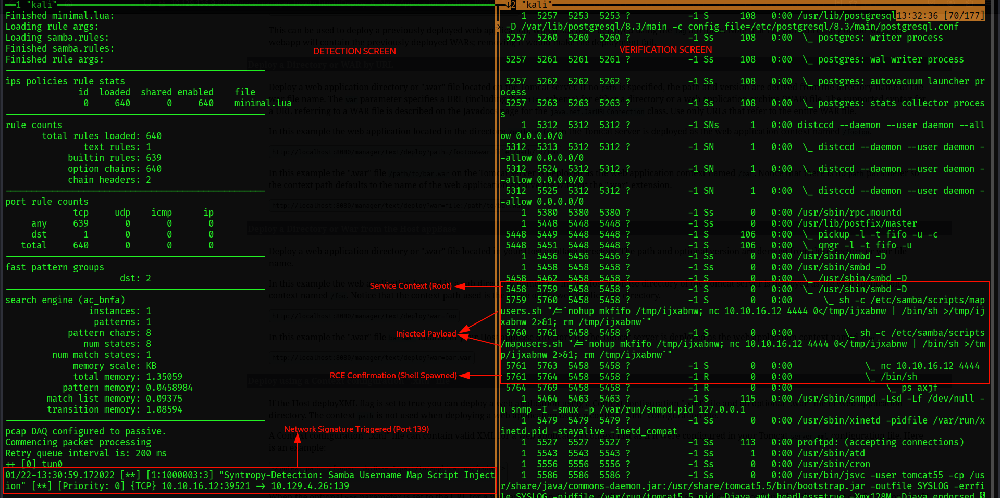

# Detection Engineering: Samba Map Script (CVE-2007-2447)

> **Syntropy Intel:** 🐧 [Case Study: Lame (Linux)](../01-HackTheBox/Linux/Lame/Report.md) | 🧠 [Mental Model: The Legacy Bridge](../00-Mental-Models/The-Legacy-Bridge.md)

### 1. Conceptual Framework
**The Artifact:**
The CVE-2007-2447 exploit abuses the `username map script` configuration in Samba. It injects shell metacharacters (like backticks `` ` ``) directly into the username field during the SMB Session Setup phase.

**The Logic:**
* **Network:** We detect the default Metasploit payload artifact (`/bin/sh`) inside the username field.
* **Endpoint:** We detect the anomaly of the Samba daemon (`smbd`) spawning an interactive shell, which violates standard file server behavior.

---

### 2. Network Signature (Snort)
**Status:** ✅ `Verified` (See Evidence Below)
**Description:** Detects the malicious payload `/bin/sh` traversing the SMB protocol (Port 139) during the exploitation phase.

```bash
# Rule: Syntropy Samba Username Map Script Injection
alert tcp $EXTERNAL_NET any -> $HOME_NET 139,445 (msg:"Syntropy-Detection: Samba Username Map Script Injection"; flow:to_server,established; content:"/bin/sh"; fast_pattern; metadata:service netbios-ssn; sid:1000003; rev:3;)
```

---

## Evidence & Proof of Work

### Combined Telemetry (Network + Endpoint)
**Methodology:** Live exploitation of CVE-2007-2447 on HTB Lame.
**Observation:** The split-screen view captures the attack lifecycle in real-time.

1.  **Left Panel (Snort NIDS):** The rule `SID:1000003` successfully intercepted the malicious payload `/bin/sh` traversing the SMB protocol immediately upon exploitation.
2.  **Right Panel (Endpoint Process Tree):** The command `ps axjf` reveals the "Smoking Gun" process heritage. The Samba daemon (`smbd`, PID 5458) is observed spawning a shell (`sh`, PID 5764) and a reverse connection (`nc`), confirming successful Remote Code Execution.


